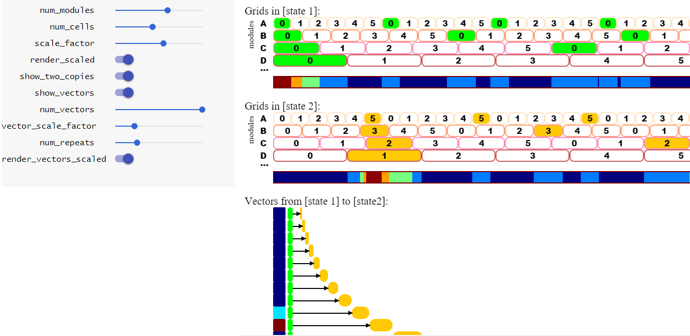

## toy-grids
You can view the thing live at [d1manson.github.io/toy-grids](http://d1manson.github.io/toy-grids).  There's a small amount of explanation on that page, although  I could be a bit more helpful.

### screenshot

### developing
Everything is JavaScript/HTML5, but it makes heavy use of [Polymer 1.0](https://www.polymer-project.org/1.0/), including the vulcanize tool, plus you probably need Bower....which is to say that you're going to need to install [nodejs](https://nodejs.org).  And you'll need something (like Python, although I beleive you can also use nodejs) to run a localhost server (I have python and simply use the command `python -m SimpleHTTPServer 5103`).
